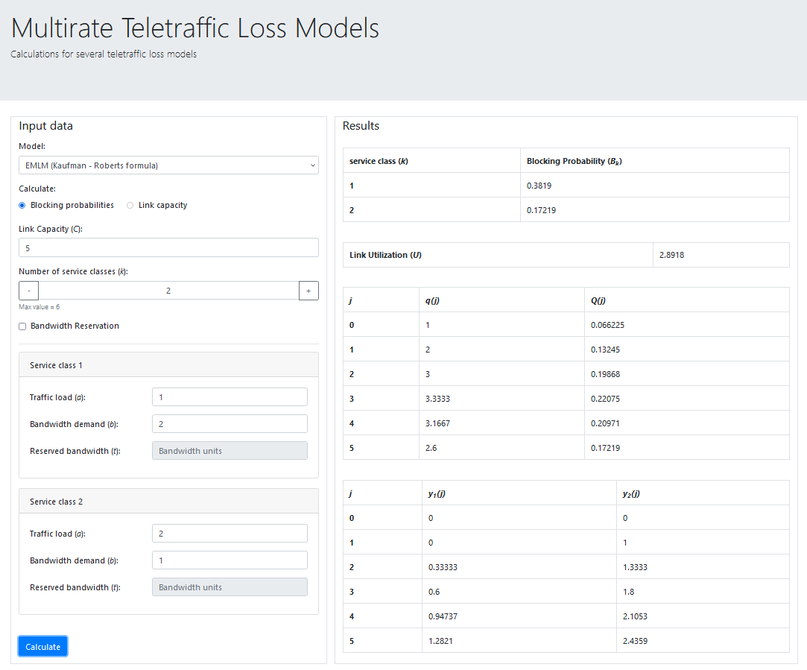

## Teletraffic models

A web app to calculate Blocking Probabilities, Link utilization and q(j)s for several teletraffic loss models.

### Prerequisites

Python version 3.x is recommended.

Install flask:
```
pip install flask
```
### Run

Run the flask app locally:
```
python main.py
```
> By default, Flask will run on http://127.0.0.1:5000/ or http://localhost:5000/.

Open a web browser and visit http://localhost:5000/.


